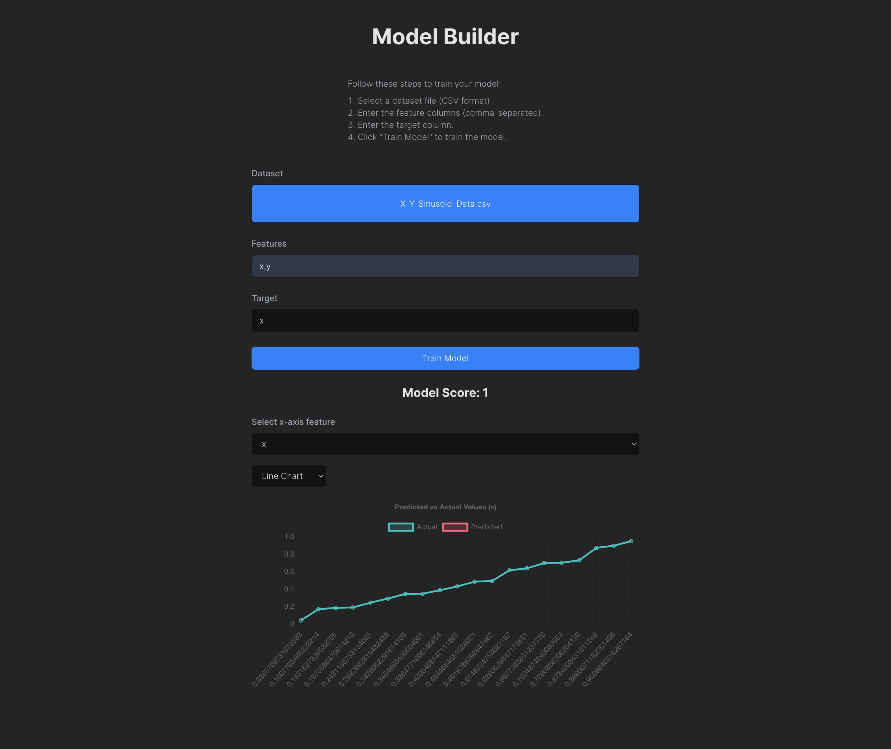

# Model Trainer


Model Trainer is a web application that helps users create, train, and evaluate machine learning models with an easy-to-use interface. The application is built with a Vue.js frontend and a Flask backend.



## Features

- User authentication and project management
- Dataset upload and preprocessing tools
- Selection and configuration of ML models
- Model training and evaluation
- Visualization of model performance
- Export of trained models

## Technologies

### Frontend

- Vue.js with TypeScript
- Tailwind CSS
- Vue Router
- Pinia for state management
- Axios for HTTP requests

### Backend

- Flask
- Flask-Cors
- Pandas
- Scikit-learn

## Getting Started

### Prerequisites

- Node.js and npm
- Python 3.7+
- Git

### Installation

1. **Clone the repository:**

    ```bash
    git clone git@github.com:nbursa/model-trainer.git
    cd model-trainer
    ```

2. **Set up the backend:**

    ```bash
    python3 -m venv .venv
    source .venv/bin/activate
    pip install -r requirements.txt
    ```

3. **Set up the frontend:**

    ```bash
    cd client
    npm install
    ```

### Running the Application

1. **Start the backend server:**

    ```bash
    source .venv/bin/activate
    python run.py
    ```

2. **Start the frontend development server:**

    ```bash
    cd client
    npm run dev
    ```

3. **Open your browser and navigate to:**

    ```
    http://localhost:5173
    ```
